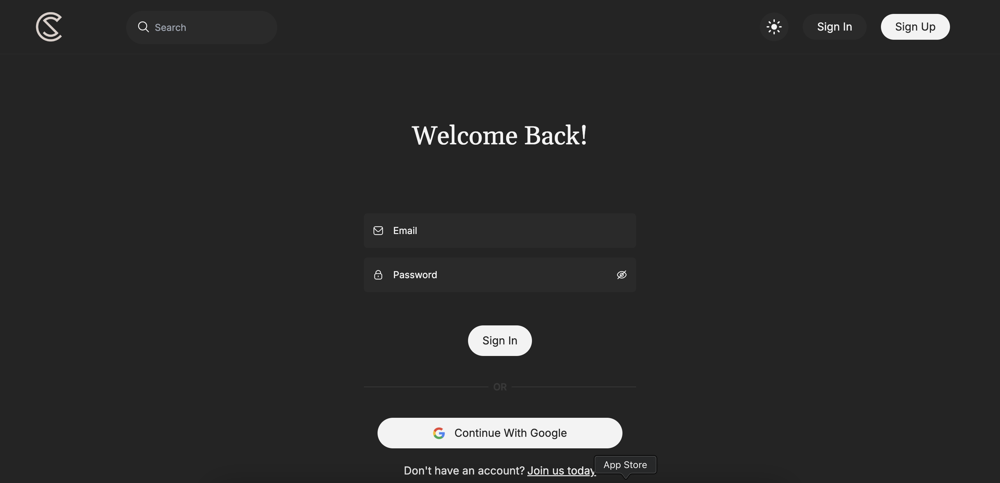
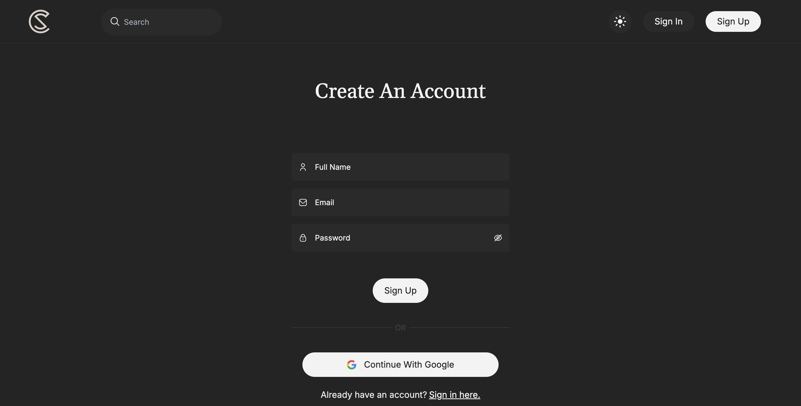
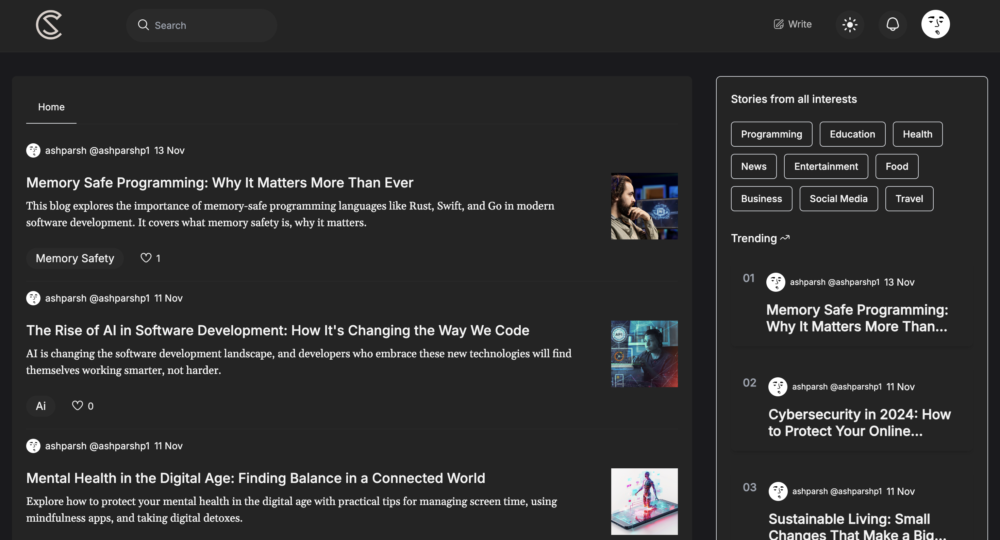
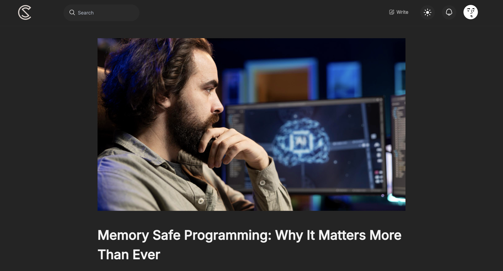
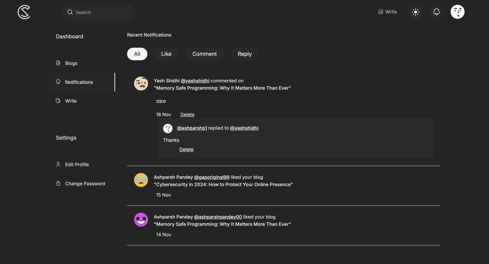

[Chronospace](https://chronospace.netlify.app/)

	• A MERN-based blogging platform inspired by MDN blogs, built as a React course
	  project for college.
Features

	• User roles: Admin and normal users.
	• Admins can write, edit, and delete blogs.
	• Nested comments with like, delete, and notification support.
	• Blog recommendations, trending section, and responsive design.

Technologies Used

	• Frontend: React, Tailwind CSS
	• Backend: Express, MongoDB
	• Authentication: Firebase Auth and JWT
 	• Image Storage: Integrated AWS S3 for image storage.

Installation

	1. Clone the repository.
	2. Run npm install in both backend and frontend directories.
	3. Set up Firebase and MongoDB credentials in the .env file.

Usage

	• Start the backend server with npm start.
	• Launch the frontend with npm run dev.

# **Screenshots**  

### **1. Login Page**  

_A secure login page with Firebase Auth and JWT support._  

### **2. Signup Page**  
  
_A signup page with validation for email, password, and more._  

### **3. Home Screen**  
  
_Features trending blogs, recommendations, and responsive design._  

### **4. Blog Page**  
  
_Shows detailed blog content, comments, and nested replies._  

### **5. Notifications Page**  
  
_Real-time notifications for likes, comments, and activity._  
